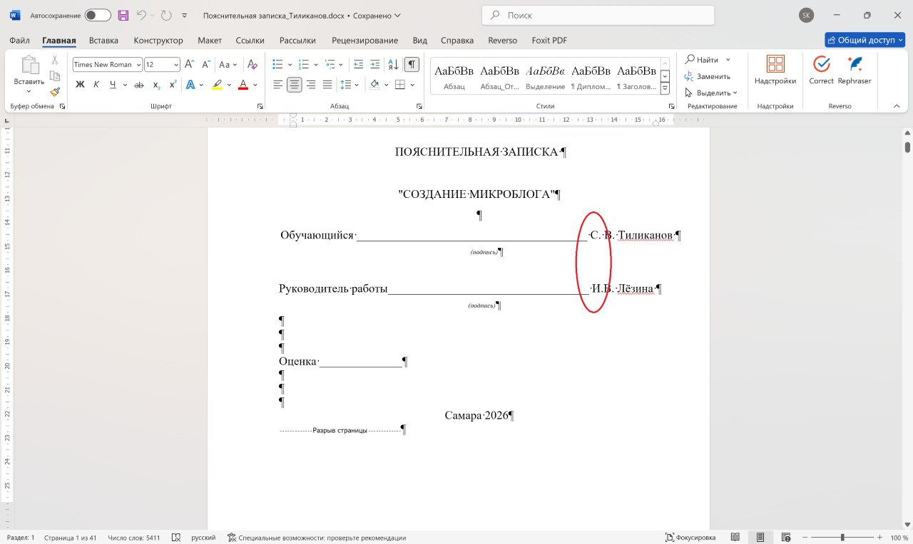
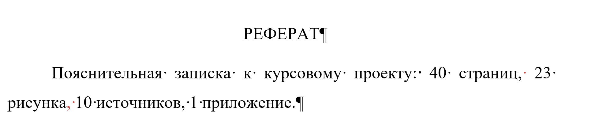
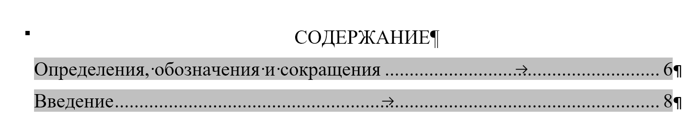
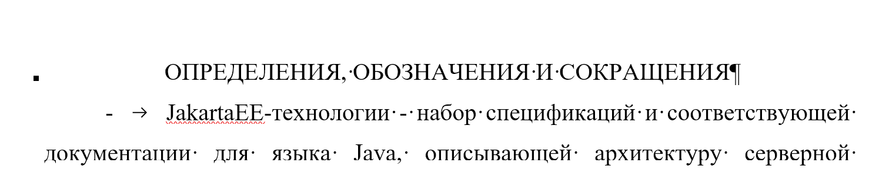
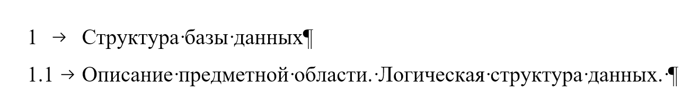

#### STO_SGAU_02068410-004-2018 - настольная книга при оформлении курсовой и диплома. Сверяйте с ней все что можно в своем отчете. Все что нельзя - тоже сверяйте.

#### Пара моментов, на которых она меня поймала:

На шрифтах, кеглях, отступах и межстрочном интервале останавливаться не буду. Чай не первый год учимся. 

- Начнем прямо с титульной страницы

Инициалы выполняющего работу и проверяющего должны находиться ровно друг под другом:

- Следите за тем, чтобы реферат выдавал корректное содержание

- Баг стандарта, от которого кринжует даже Лезина

Структурные элементы в содержании (важно! содержании, не оглавлении) пишутся Как в обычном предложении.

Когда структурный элемент в заголовке, он пишется в В ВЕРХНЕМ РЕГИСТРЕ. Всем любителям автосборки содержания посвящается.

- Понятное дело, структурный элемент не нумеруется, а заголовок нумеруется. При этом в любом заголовке и подзаголовке последняя точка при нумерации не ставится. 

- Логическая схема оформляется по-русски. Физическая по-английски.

- Оформление рисунка выравнивается по центру, без отступов: 

Рисунок 2 — Физическая схема базы данных

- Обратите внимание в СТО как и чем можно оформлять нумерацию и перечисление (перечисление - через дефис, не тире)

- Блок-схемы при описании алгоритма разрешены, даже желательны. Use-case - очень желательна. У меня в отчете есть диаграмма последовательности. Вот этого лучше не стоит. Если только очень хочется ;)

#### Отдельно про список источников.

- Источников должно быть не менее 10. Для диплома не менее 15.

- Оформление списка будет строго проверяться. Так что следите за этим.

- Каждый источник должен иметь ссылку на себя в самом тексте.

- Источники должны быть сортированы по порядку первого появления в документе.

